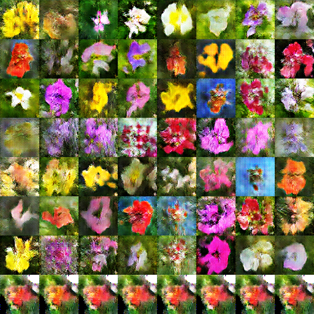

# DL_contest4_codes_viewing
(It's just a repo for TA to view our codes, and the following markdown is actually our report for this contest)


# Contest 4 Report

Team Members:
- 103062240 蔡宗宇
- 103062224 劉哲宇
- 103062101 陳孜宇

Here is the [codes](https://github.com/Nash2325138/DL_contest4_codes_viewing) for TA to view.

----

In the begining of the contest, we trace through the given sample code and run it to see its performance. The result is not satisfying.

So we start to try many experiment and gradually modify our model according to the result of experiment.

Here are what we've done and we'll introduce each of them on the following paragraphs:
- Change architectures of G and D
- Use pretrained SpaCy word embedding in TextEncoder
- Add gradient penalty to d_loss
- Get more captions per images (and shuffle)
- Add 'wrong images with false label' to train with D
- Random distortion to images
- Use pretrained thought vector (encode sentence and store them to use)

# Change architectures of G and D
We changed the generator and discriminator according to the following architecture according to [the repo](https://github.com/paarthneekhara/text-to-image).


Since the original model in given code is too simple and it doesn't perform well, we change them using some more complex architecture (CNN and reverse CNN).

Also, we add the information (the "meaning" of the caption) to both generator and discriminator network to make them learn what the caption means.

# Use pretrained SpaCy word embedding in TextEncoder

We use pretrained word vectors fro spaCy.
- For each word in given dictionary, find the corresponding word vector.
- Replace the word embedding matrix (random initalized one) to the one we generated.
- Let it be fine-tuned during whole training process.

# Add gradient penalty to loss of discriminator
For the model of given code, the training process is **not stable** and frequently encounter the problem of **mode collapse**. For example:
#### <center> Train with no gradient penalty (85 epoch)</center>


#### <center> Train with no gradient penalty (90 epoch)</center>


To solve it, we add gradient penalty based on the idea of WGAN-GP to disctiminator's loss to make training process more stable.


```python
    # ---------------------- gradient_penalty ---------------------- #
            self.GP_lambda = self.hparas['GP_lambda']
            epsilon = tf.random_uniform(
                shape=(tf.shape(self.generator.outputs)[0], 1, 1, 1),
                minval=0,
                maxval=1
            )
            x_hat = epsilon * self.generator.outputs + (1.0 - epsilon) * self.real_image
            gradients = tf.gradients(
                Discriminator(
                    x_hat,
                    self.text_encoder.outputs,
                    training_phase=True,
                    hparas=self.hparas,
                    reuse=True
                ).logits,
                [x_hat]
            )
            gradient_penalty = self.GP_lambda * tf.square(tf.norm(gradients[0], ord=2) - 1.0)
            self.d_loss += gradient_penalty
    # ---------------------- gradient_penalty ---------------------- #
```

After adding it, our training become much more stable:
### <center> Train with gradient penalty (85 epoch)</center>


# Get more captions per image (and shuffle)
The given code only randomly choose one caption per image, which may not utalize the dataset well. Hence, we modify data_iterator to do following task:
- Randomly choose 3~5 captions for each picture (if we choose all captions, the training set is so large that it takes long time to train).
- Shuffle the whole training set.

The following shows the code of how we accomplish it some training result:


```python
def data_iterator(filenames, batch_size, data_generator, shuffle_buffer=None,
                  augmentation=False, number_use_captions=1):
    # Load the training data into two NumPy arrays
    df = pd.read_pickle(filenames)

    image_path, caption = [], []
    for row in df.iterrows():
        caps = row[1]['Captions']
        path = row[1]['ImagePath']
        num_to_choose = min(number_use_captions, len(caps))
        caption.extend(random.sample(caps, num_to_choose))
        image_path.extend([path for _ in range(num_to_choose)])
    image_path = np.asarray(image_path)
    caption = np.asarray(caption)
    
    # shuffle dataset to prevent consective same image due to num_to_choose >= 2
    shuffle_index = np.random.permutation(len(image_path))
    image_path = image_path[shuffle_index]
    caption = caption[shuffle_index]
    

    # Assume that each row of `features` corresponds to the same row as `labels`.
    assert caption.shape[0] == image_path.shape[0]

    dataset = tf.data.Dataset.from_tensor_slices((caption, image_path))
    dataset = dataset.repeat()
    if shuffle_buffer is not None:
        dataset = dataset.shuffle(shuffle_buffer)
    dataset = dataset.map(data_generator)
    dataset = dataset.batch(batch_size)

    iterator = dataset.make_initializable_iterator()
    output_types = dataset.output_types
    output_shapes = dataset.output_shapes

    return iterator, output_types, output_shapes

```

### <center> Using 1 caption per image to train for 250 epoch with gradient penalty</center>


### <center> Using 5 captions per image to train for 50 epoch with gradient penalty</center>


We can see that model using only 1 caption per image can generate nice pictures but **not related to the given text** and have **various type and color** even if they are given the same text (The same row use the same text description):

We expect that using more captions per image will make our TextEncoder learn how to interpret data better, however, it seems not really solve this problem as you can see for the second example.

# Add 'wrong images'
In order to really solve the problem stated above, we add 'wrong image with false label' to train with D.
That is, give a caption and a random image from dataset, and give it false label.
(To let D learn whether the image has relation with the caption.)
After applying this, our score improved a little.
What we do is:
- For each caption, random pick a picture from given training dataset.
- Thus, our model has 3 input nodes:
    - Caption
    - Real image
    - Wrong image

Below is the result before and after we add wrong images into the network.
Although they seems both not good enough, we had little improvement on the score.

*Without Wrong Images (200 epoch)*

*With Wrong Images (200 epoch)*


# Random distortion to images

We try to random distort the image before feed it to the model, for example, flip left-right, random brightness. We didn't try so many operation here because the caption may contain some words related to color (for example, a "red" flower), we can't apply any operation that may change the color of the image.
What we did:
- Randomly flip left/right
- Random brightness

But the training result isn't so good (the sample output is very weird).

# Use pretrained Skip Thought vector
Since our TextEncoder model can hardly learn the meaning of text and generate almost random flowers for the same text, we want to use some other pretrain sentence to vector models to replace TextEncoder.

Since [the repo](https://github.com/paarthneekhara/text-to-image) gives pretty results of this task, we decide to try if its method: using Skip Thought vector to encode captions.

### Skip Thought Vector
Skip Thought Vector is a sentence encoder model proposed by [this paper](https://arxiv.org/abs/1506.06726), and they also released their implementation and pretrained model in the [github repo](https://github.com/ryankiros/skip-thoughts). Hence, by following the instructions of its repository we can install and make use of it for our task.

### Encode the training/testing dataset and sample descriptions
Note that the code given by authors of Skip Thought Vector was written in Python 2. Also, loading the model and encoding sentences by it are slow and cost unignorable memory, so we decided to encode the training/testing dataset and sample descriptions beforehand rather than when every time we need to use them.

The following code is how we encode and transform the test data, and it's the similar process for other dataset.


```python
import pandas as pd
import numpy as np
import skipthoughts


dictionary_path = '../../dictionary'
id2word_dict = dict(np.load(dictionary_path + '/id2Word.npy'))

data_path = '../../dataset'
df = pd.read_csv(data_path + '/testData.csv', index_col=0)
caps = df['Captions'].values
caps = [eval(cap) for cap in caps]
caps = [[id2word_dict[word] for word in cap if id2word_dict[word] != '<PAD>'] for cap in caps]
caps = [' '.join(cap) for cap in caps]

model = skipthoughts.load_model()
encoder = skipthoughts.Encoder(model)

test_caps_4800 = encoder.encode(caps)
np.save('../../dataset/test_captions_4800.npy', test_caps_4800)
```

Note that we process the output .npy file into .pkl using python 3 before we use it, because:
1. The transformed training data may be too large for numpy array to fit in memory (unlike testing data, training data are parted into several segment to process), so we want to use it as a python list.
2. The reason why we didn't store .pkl directly is that there are some protocal conflics of pickle between Python 2 and 3.


Then, to use the transformed data, we need to
### 1. Modify data_iterator (iterator of test data is similar)


```python
with open('./dataset/thought_front2400.pkl', 'rb') as f:
    thought_caps = pickle.load(f)

def data_iterator(filenames, batch_size, data_generator, shuffle_buffer=None,
                  augmentation=False, number_use_captions=1):
    # Load the training data into two NumPy arrays
    df = pd.read_pickle(filenames)
    caption = []
    image_path = []
    for i, row in enumerate(df.iterrows()):
        index = row[0]
        caps = list(thought_caps[i])
        path = row[1]['ImagePath']
        num_to_choose = min(number_use_captions, len(caps))
        caption.extend(random.sample(caps, num_to_choose))
        image_path.extend([path for _ in range(num_to_choose)])
    image_path = np.asarray(image_path)
    caption = np.asarray(caption)
    
    # shuffle dataset to prevent consective same image due to num_to_choose >= 2
    shuffle_index = np.random.permutation(len(image_path))
    image_path = image_path[shuffle_index]
    caption = caption[shuffle_index]
    

    # Assume that each row of `features` corresponds to the same row as `labels`.
    assert caption.shape[0] == image_path.shape[0]

    dataset = tf.data.Dataset.from_tensor_slices((caption, image_path))
    dataset = dataset.repeat()
    if shuffle_buffer is not None:
        dataset = dataset.shuffle(shuffle_buffer)
    dataset = dataset.map(data_generator)
    dataset = dataset.batch(batch_size)

    iterator = dataset.make_initializable_iterator()
    output_types = dataset.output_types
    output_shapes = dataset.output_shapes

    return iterator, output_types, output_shapes
```

### 2. Remove TextEncoder
In order not to change lots of codes in the models, I just make TextEncoder.output=text directly and build a garbage node to make saver have something to save.


```python
class TextEncoder:
    """
      Encode text (a caption) into hidden representation
      input: text (a list of id)
      output: hidden representation of input text in dimention of TEXT_DIM
    """

    def __init__(self,
                 text,
                 hparas,
                 training_phase=True,
                 reuse=False,
                 return_embed=False):
        self.reuse = reuse
        self._build_model()
        self.outputs = text

    def _build_model(self):
        with tf.variable_scope('rnnftxt', reuse=self.reuse):
            garbage = tf.Variable(
                initial_value=0,
                trainable=True,
                name='useless_garbage'
            )
```

### 3.Change the type of input placeholder
Because the original input captions have size 20 and type int, we need to change the placeholder declaration inside the GAN model like:


```python
self.caption = tf.placeholder(
    dtype=tf.float32,
    shape=[self.hparas['BATCH_SIZE'], 2400],
    name='caption'
)
```

### Result
Here is some sample outputs to visualize the effect of using Skip Thought Vector

### <center> 3 captions per image, unit skip thought vector, with gradient penalty, 120 epoch</center>


### <center> 3 captions per image, unit skip thought vector, with gradient penalty, 270 epoch</center>


From the pictures above, we can see the outputs at the same row are finally similar and related to the text, especially the general color of petals (Some details like central pistil are not generated for most case, thought) The score on kaggle gets significant improvement after we use Skip Thought Vector.

Note that we just use the first 2400 dimention of skip vector which corresbonding the sentence generated by uni-skip model. The part of the bi-skip model (last 2400 dimention) was tried, but we ran out of the time of competition before our model reach stable status.

# Demo

this flower has petal that are yellow with black stamen


this flower has petal that are white with a small stigma


this flower has a few bright pink petal that turn more white in the center


this flower has petal that are orang with yellow center'


a flower with white petal and a with yellow stamen'


The demo examples above are extracted from test data.

By the way, when we generate these examples' origin texts from ids, we found that there are a lot of misspelled words (lots of 'e' disappear)... they probably come from the wrong transformation between word2id and id2word.

This might make skip thought encode the sentence wrongly and affect the training process.

## A bug we found
Because we add our codes based on example code, we found there is a problem in example code.


```python
for _step in range(n_batch_epoch):
    step_time = time.time()
    image_batch, caption_batch = self.sess.run(
        self.iterator_train.get_next())
```

For each execution of `self.iterator_train.get_next()`, there is a node been added into the tensorflow graph.
Thus, the memory used will increase during the training process.
If the training process takes long time, it may leed to resource exhaustion.

A simple fix it is just let it be executed only once (like other codes given in the lab).


```python
next_element = self.iterator_train.get_next()
for ......
    image_batch, caption_batch = self.sess.run(next_element)
```

# Conclusion
1. After listening to the winners' sharing and discussing with others after compitition, we think that our model can get better if we use stackGAN.
2. We learn that we should survey more to see what techniques are used in other's work before just adding something what we guess will work, because the competition time is short, and those work can usually bring great improvement.


```python

```
